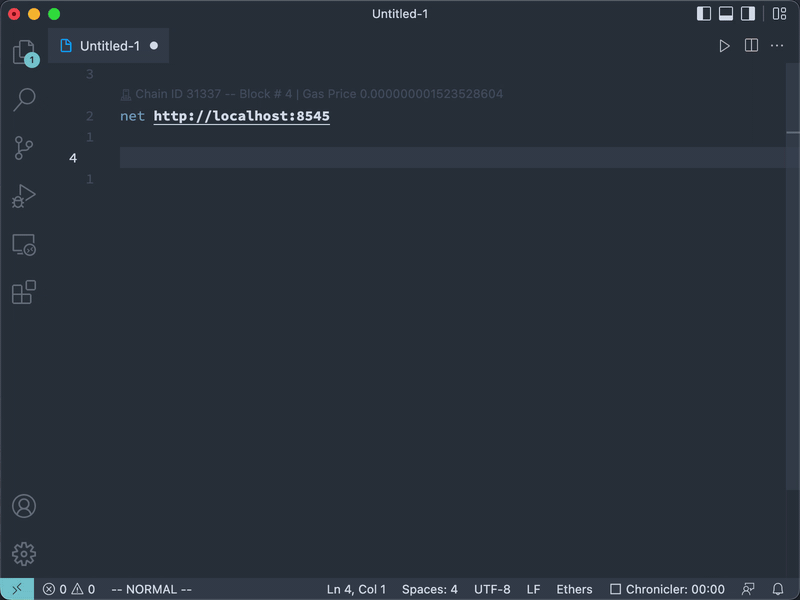

# VS Code Ethers Mode

Ethers Mode allows you to call Smart Contracts methods using [Ethers.js](https://docs.ethers.io/v5/) and view the response in Visual Studio Code directly.



This is a sample extension that shows the usage of the CodeLens API.

## Main Features

- Call Smart Contract method by writing its [Human-Readable ABI Signature](https://blog.ricmoo.com/human-readable-contract-abis-in-ethers-js-141902f4d917)
- Detect contract or EOA address and provide its balance
- Call multiple Smart Contract methods in a single file
- Send method arguments and autodetect argument types
- View return value as a notification (**CHANGE**)
- Provide network info
- Select multiple network in a single file networks (using `net <network name | RPC URL>`)
- `Ethers` language support
  - `.ethers` and `.web3` file extensions
  - Syntax highlight of Human-Readable ABI Signatures if Solidity extension is installed
  - TODO Auto completion for method, url, header, custom/system variables, mime types and so on
  - Comments (line starts with `#`) support
  - Code snippets for several ERCs
  - TODO Support navigate to symbol definitions(request and file level custom variable) in open `http` file
  - CodeLens support to add an actionable link to call method
  - CHECK Fold/Unfold for request block

## Usage

In a new editor, select a network, followed by a contract address and a method call

```ethers
net fuji

0x5425890298aed601595a70AB815c96711a31Bc65
name() view returns (string)
```

Once you prepared a Smart Contract method call,
click the `Call Smart Contract Method` link above the call
(this will appear if the file's language is `Ethers`, by default `.ethers` and `.web3` files are like this).

## Contributing

- Execute `yarn install` in terminal to install dependencies
- Execute the `Run Extension` target in the Debug View.
  This will:
  - Start a task `npm: watch` to compile the code
  - Run the extension in a new VS Code window

### VS Code API Overview

### `languages` module

The extension uses [`languages.registerCodeLensProvider`](https://code.visualstudio.com/api/references/vscode-api#languages.registerCodeLensProvider)
to register the `CodeLensProvider`.
